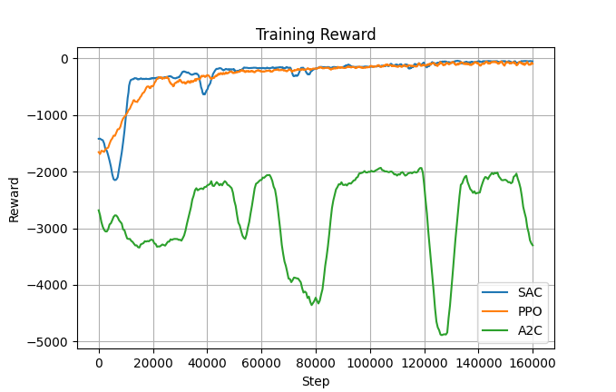

# DRL Peg-in-Hole Task Using Robotic Arm


This project provides a Deep Reinforcement Learning (DRL) environment built with **PyBullet** and **Gymnasium**, simulating a UR5 robotic arm performing a **peg-in-hole insertion task**—a classic challenge in precision robotic assembly.

The UR5 robot is controlled via its **end-effector axis**, guiding a peg into a hole on a fixed object. A **camera is mounted directly on the robot’s end-effector**, capturing **100×100 grayscale images** as visual input. This configuration enables **eye-in-hand visual servoing**, where the robot perceives and reacts to its environment from its own point of view.

In testing, the SAC agent was evaluated over 1000 episodes, achieving a final success rate of **95.6%** in completing the peg-in-hole task. This demonstrates the algorithm's strong performance in precision control and robust policy learning under visual feedback.
---

## Reward Convergence Plot



| Algorithm | Convergence Speed | Final Performance | Stability   | Success Rate |
| --------- | ----------------- | ----------------- | ----------- | ------------ |
| **SAC**   | 🟢 Fast           | 🟢 Excellent      | 🟢 Stable   | **95.6%**    |
| PPO       | 🟡 Moderate       | 🟡 Bad            | 🟡 Average  | **26.9%**    |
| A2C       | 🔴 Slow           | 🔴 Failure        | 🔴 Unstable | **0.0%**     |

---

## Environment Features

- **Using Object**: UR5 with peg, camera, and an object with a shaft hole 
- **Observation Space**: 100x100 grayscale image (single channel)
- **Action Space**: Continuous small displacements in X/Y/Z axes
- **Task Goal**: Successfully insert the peg into the hole center
- **Collision Detection**: Detect contact with table or hole edges
- **Reward Design**: Encourages approaching the goal and successful insertion; failure terminates episode
- **Compatibility**: Supports Stable-Baselines3 algorithms (SAC / PPO / A2C)

---

## 💻 Installation Instructions

Recommended Python 3.9+ and install the following packages:

```bash
pip install pybullet gymnasium stable-baselines3 matplotlib pandas
```

For TensorBoard support:

```bash
pip install tensorboard
```

---

## 🚀 Usage

All operations can be done through main_rl.py.


### 🔧 Train Model

Uncomment the `train(...)` line and set the desired agent and timesteps:

```python
agent_name = "sac"
train(agent_name=agent_name, total_timesteps=250000, save_freq=10000)
```

Then run:

```bash
python main_rl.py
```

### 🎮 Test Model

Uncomment the `test_rl_model(...)` line:

```python
agent_name = "sac"
test_rl_model(agent_name)
```

Then run:

```bash
python main_rl.py
```

The script will load the checkpoint from `checkpoints/sac_model_160000_steps.zip` for testing.

### Plot Reward Curve

Uncomment the `plot_reward_data()` line in the script:

```python
plot_reward_data()
```

Then run:

```bash
python main_rl.py
```

It will generate the reward convergence plot based on logs in `logs/monitor_*.csv`.

## Training Environment Info

- 📦 Hardware: NVIDIA RTX 3050 Laptop GPU (4GB VRAM)
- 🧠 Framework: Stable-Baselines3 (with CUDA auto acceleration)
- ⏱️ Training Time: ~1 hour for 250,000 steps (depends on GPU)
- 💾 Checkpoints: Automatically saved every 10,000 steps in `checkpoints/`

---

## References

- [PyBullet Documentation](https://pybullet.org/)
- [Stable-Baselines3](https://github.com/DLR-RM/stable-baselines3)
- [Gymnasium API Reference](https://gymnasium.farama.org/)
- [Model](https://github.com/ElectronicElephant/pybullet_ur5_robotiq)
- [Catalyst.RL](https://github.com/arrival-ltd/catalyst-rl-tutorial)
